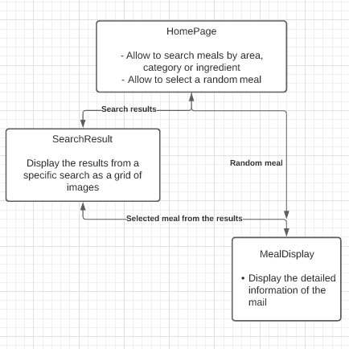

# MEAL-App

## Table of Contents

- [Description](#description)
- [Project Objective](#project-objective)
- [Sample](#sample)
- [MVP / Stretch Goals](#mvp-stretch-goals)
- [Current Features / User Stories](#current-features)
- [Technologies used](#technologies-used)
- [Project takeaways](#project-takeaways)

## Description

* MealDB API

* Quotable API

## Project objective

## Sample

## MVP / Stretch Goals

### Basic MVP

### Stretch goals

## Technologies used

## Project takeaways
